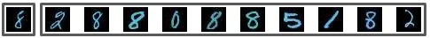
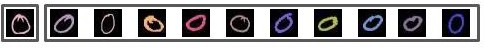

# Conditional-Similarity-Network-MNIST
This is a toy example of Conditional Similarity Networks on MNIST dataset. It is based on a paper named "Conditional Similarity Networks" written by A. Veit, S. Belongie and T. Karaletsos.

## Overview
In this paper, they proposed a network named "Conditional Similarity Network" to measure the similarity between images having various attributes. The network consists of two partial networks. One is Convolutional Network to extract features from an image, and the other is a set of mask, each of which is corresponding to one attribute(color, shape, category or something), and works as an element-wise gating function selecting relevant features of the attributes from a feature vector. The most important thing is that the set of mask is also trainable. That is, the masks learn by themselves what features are actually need to distinguish images with respect to the corresponding attributes. If we apply a mask on the feature vector, then we can measure conditional similarities of images.

## The characteristics of the network
It is based on deep metric learning. Deep metric learning is to train a network that maps similar input data to similar feature vectors. It means that deep metric network embeds input data in high dimensional space into low dimensional space, conserving the metric between the data. The most usual way to implement deep metric leaning is Triplet network. First, we pick a input x, calle an anchor. Then We choose a positive sample x+, which is similar to x(for example, x+ is in the same category with x), and a negative sample x-, which is not similar to x. Now, we construct a 3 parallel networks, each of which has the same weights with the others, and feed a pair of inputs (x, x+, x-) into the networks. Then, we measure the distance between the anchor output and the positive output(d+) and the distance between the anchor output and the negative output(d-). We want d+ to be small and d- to be large. So we use a hinge loss = max(0, (d+)-(d-)+margin) as our objective loss function.

According to the paper, Conditional Similarity Network works better to learn multiple similarities, which shares some features between, than standard Triplet network.

## Question
The network has better performance on learning multiple similarities that correlate each other. In this case, some masks for the similarities are activated on the same indices. Then what if the similarities is unrelated? For example, there is a digit image which has a font color. It has two attributes, digit and color. However there is no relation between two. It means that, in feature vector, some dimensions are representing color attribute, and some dimensions are representing digit attribute, but there is no index that represent both color and digit. I wanted to experimentally show that if I trained the network with unrelated features, the mask of each feature does not share indecies with the other masks.

## Experiment setting
1. Data Set

I made a new data set from MNIST dataset. First, I picked rgb values from [0~200](to avoid a letter to be white) randomly per iamge, and add color on a fixel whose greyscale is nonzero. Finally I got a image whose backgraound is black and digit is colored.
Because my computer is super slow, I just only use 5000 images from MNIST dataset. I assigned 50% of the images to traning set, 30% to validation set, 10% to test set.

2. Network structure

I used Lenet as the encoder of the network, 2 convolutional layers followed by 2 dense layers. Output dimension of the encoder is 20. I used two masks for the attributes, color and digit. So the total dimension of the masks are [20, 2]. I used deep metric learning mentioned above.

3. Training

I used AdamOptimizer as the optimizer of the network. The learning rate was 1e-3. I set the batch size 100. 
For each minibatch, I picked 100 triplets randomly from training dataset. In case of color, i choose a positive sample whose rgb is closer to that of an anchor, and a negative smaple whose rgb is far from that of an anchor. In case of digit, i choose a positive sample whose digit is the same as that of an anchor, and a negative smaple whose digit is diffrent from that of an anchor.
I used hinge loss as loss function.

4. Test

To test the model, I picked an anchor from the test set. And then, I passed all the inputs in test set into the network. Finally I measured the distance between anchor output and the others. I choose 10 closest inputs from the anchor.

## Result
At first, i ran the training with 2000 iteration. The result is as follows. The first box means anchor, and the second box represents 10 closest samples.

   
    
   <b>Case 1. color</b> 
 

 

   
    
   <b>Case 2. digit</b> 
 

Isn't that strange? Look at the result of case 1. The positive samples are more likely to have the same digit as the anchor. 50% of the sample are 8!. It implies that color mask and digit mask are correlated. Actually, the coefficients of two masks are as follows

           color     |     digit
      ---------------|---------------
      1.3572024e+00  | 9.2015648e-01
      -3.4946132e-01 | 4.3405625e-01
      1.0715414e+00  | 5.0198692e-01
      2.5438932e-01  | 9.0543813e-01
      9.8532408e-01  | 9.0611883e-02
      1.2879860e+00  | -1.5302801e-01
      3.0987355e-01  | 1.0871087e+00
      7.4810916e-01  | 1.9085248e+00
      1.4328172e+00  | 4.6207100e-01
      1.5345807e+00  | 9.2612886e-01
      1.0465456e+00  | 2.1864297e+00
      -8.5371196e-02 | 1.8422171e-01
      2.2996366e-03  | 3.0973017e-01
      -2.6021469e-01 | 9.8107708e-01
      9.2680907e-01  | 6.4489403e-05
      1.5980076e+00  | 3.8404701e-07
      8.7253183e-01  | 1.9499277e-01
      1.8782541e+00  | 1.8202764e-01
      4.7374862e-01  | 2.1356693e-06
      9.1653597e-01  | 1.3017328e+00
      
You can see that color and digit attributes shares 11th row.
